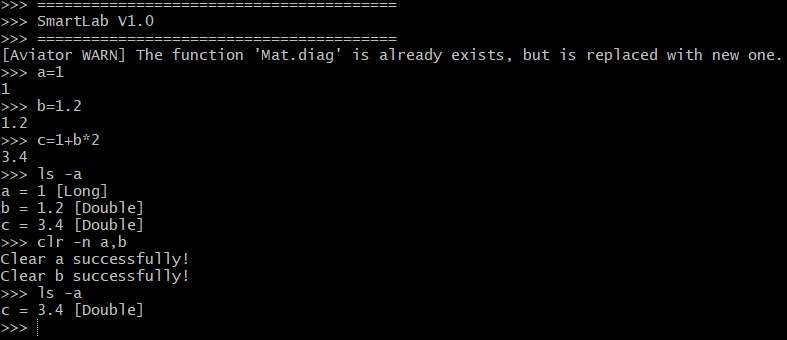
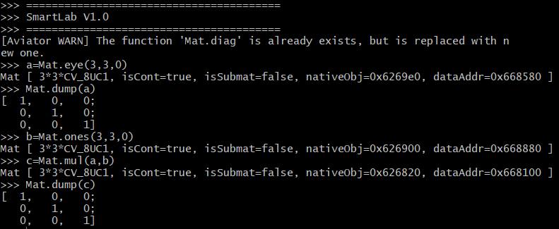

# smartlab #

<a href="https://github.com/search?q=jcommander">
    
</a>
<a href="https://github.com/killme2008/aviator">
    
</a>
<a href="https://github.com/Jeffery1993/smartlab/blob/master/LICENSE">
    
</a>
  
SmartLab是一个模拟 MATLAB 的Java命令行小工具。

## 截图 ##
### 基本使用 ###


### 矩阵计算 ###


## 特点 ##
- [x] 类似MATLAB的执行方式
- [x] 基于aviator实现表达式编译和计算
- [x] 使用OpenCV实现矩阵计算和图片处理
- [x] 支持工作空间数据导入和导出

## 编译 ##
```
// 拷贝代码到本地
git clone https://github.com/Jeffery1993/smartlab.git
// 编译打包，打包结果在packaging模块的target目录下
mvn clean install
// 在目录下执行start.sh脚本启动命令行
./start.sh
```
